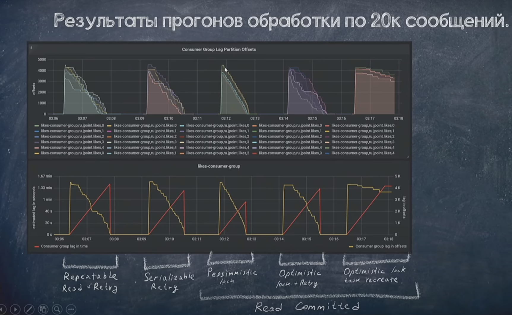
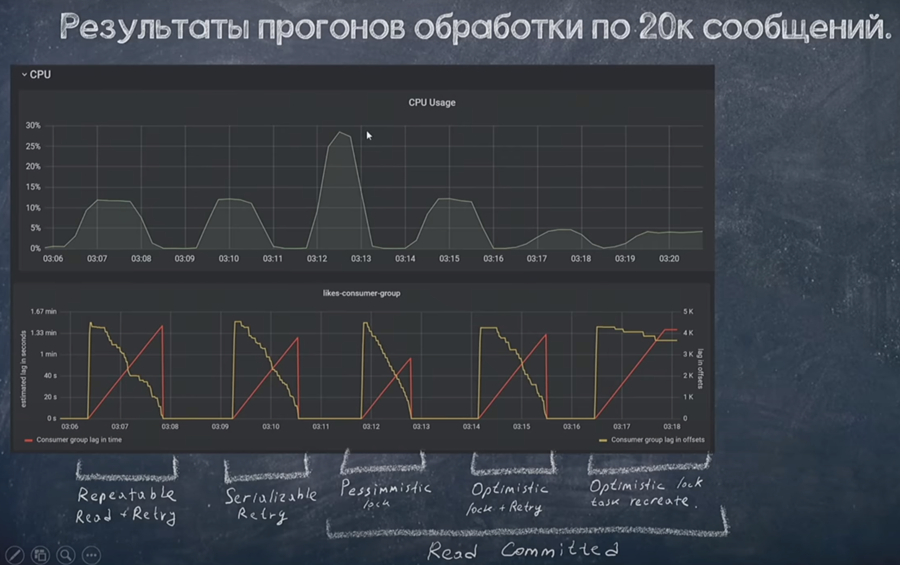

# РАБОТА С БД

## Масштабирование
**Партиционирование** - процесс заключается в разбиении данных на части по какому-либо признаку. Например, таблицу можно разбить на две по признаку чётности. Причиной для использования партицирования является необходимость в повышении производительности. Это происходит из-за того, что поиск осуществляется не по всей таблице, а лишь по её части. Другим преимуществом этого метода является возможность быстрого удаления неактуального фрагмента таблицы.

**Шардирование** - это дробление большой таблицы на разные ноды. По шард ключу. Это принцип проектирования базы данных, при котором части таблицы хранятся раздельно, на разных физических серверах.

## Основные команды postgresql
1. Подключение к БД. `psql -h <REMOTE HOST> -p <REMOTE PORT> -U <DB_USER> <DB_NAME>`
2. Подключение к базе `\c <DB_NAME>` or `\connect <DB_NAME>`
3. Просмотр списка таблиц `\dt` or `\dt <schema_name>.*` or `select table_name from information_schema.tables where table_schema = 'public';`
4. Проверка текущих соединений `SELECT pid, usesysid, usename, application_name, query_start, query FROM pg_stat_activity;`
5. Просмотр уровеня изоляции транзакций `SHOW TRANSACTION ISOLATION LEVEL;`
6. Установка уровня изолции транзакций для текущей транзакции `BEGIN ISOLATION LEVEL <transaction_mode>`
7. Просмотр текущих блокировок `select * from isotest;` or `select locktype, database, relation, page, tuple, virtualtransaction, pid, mode, granted from isotest;`


## Нормализация БД

Нормализация - это приведение структуры хранения данных в БД в тот вид
при котором уменьшает избыточность данных, возможные проблемы с
консистентностью.
 

**1NF** - должны быть уникальные строки (каждая строка, это каждая
отдельная сущность). Не должно быть составных значений в колонках.

*Перед нормализацией*: Таблица **books** (*book\_name**s**,
author\_name, author\_birthday*). В одной строке находится автор, а в
колонке *book\_names* список всех его книг.

*После нормализации:* Таблица **books** (*book\_name, author\_name,
author\_birthday*). Теперь каждая отдельная книга находится в отдельной
строке.

**2NF** - каждый атрибут (колонка) полностью зависит от первичного
ключа. Если мы просто добавим **PK** то таблица сразу переходит в форму
**2NF**. Если **PK** составной, то атрибуты должны зависит полностью от
всех частей PK, а не только от какой-то отдельной его части.

*Перед нормализацией:* Таблица **books** (*book\_name, author\_name,
author\_birthday*). Атрибуты не зависят от **PK** потому что он
отсутствует.

*После нормализации:* Таблица **books** (**id,** *book\_name,
author\_name, author\_birthday*). Добавляем **PK** теперь все атрибуты
полностью от него зависят.

**Случай с составным PK**

*Перед нормализацией:* Таблица **prices**(*shop, product, price,
shop\_birthday\_discount*). Здесь добавили составной **PK** (shop,
product) все атрибуты зависят от него кроме *shop\_birthday\_discount,
данный атрибут зависит только от shop и распространяется на все товары
магазина.*

*После нормализации:* Таблица **prices**(*shop, product, price*),
таблица **shop\_discounts**(*shop*, *shop\_birthday\_discount*).
Разделяем на две таблицы.

**3NF** - У нас есть таблица **books** (*id, book\_name, author\_name,
author\_birthday*) В данном случае *author\_birthday* зависит не от
первичного ключа, а от имени автора.

*Перед нормализацией:* Таблица **books** (*id*, *book\_name,
author\_name, author\_birthday*). Атрибут *author\_birthday* транзитивно
зависит от **PK**. т.е. *author\_birthday* зависит от *author\_name*, а
*author\_name* зависит от PK

*После нормализации:* Таблица **books** (**id, book\_name,
**author\_id***). Таблица **authors**(*id, author\_name,
author\_birthday).* Разделяем на две таблицы. Для атрибутов отсутствует
транзитивная зависимость.

## Блокировки

**Оптимистическая блокировка** - это блокировка на уровне приложения, мы
можем написать ее самостоятельно, либо использовать ту что есть в
hibernate или jpa. По сути все сводится к сравнению версии объекта перед
записью ее в базу, в случае расхождения выкидывается исключение.

При работе с оптимистичной блокировкой рекомендуется выставлять аннотацию @Retryable(MaxAttempt=10) потому что в случае расхождений версий будет вылетать исключение, и нужно снова повторить его выполнение.

**Пессимистическая блокировка** - это блокировка на уровне БД мы заранее
знаем какие объекты мы будем менять и сразу их блокируем через запрос
"SELECT FOR UPDATE". Нужно установить @Lock(PESSIMISTIC.LOCK) над методом репозитория для того чтобы блокировка заработала.

Если другая транзакция так же попробует запросить блокировку, то она
повиснет в ожидании, если не будет запрашивать блокировку а просто
изменит данные, то повиснет в ожидании когда будет выполнять COMMIT

Важно понимать что использование пессимистичных блокировок черевато появлением DEADLOCK поэтому надо внимательно использовать методы репозиториев с блокировками, а так же устанавливать таймаут для транзакций, чтобы они не висели вечно.


## Уровни изоляции транзакций

Для проверки примеров необходимо подключится с нескольких терминалов к серверу postgres.
1. Подключаемся к docker container `docker exec -it postgres bash`  
2. Подключаемся к серверу postgres `psql -U postgres -d postgres`
3. Чтобы переключится на другу базу, можно использовать команду `\c databaseName or \connect databaseName`
4. Проверяем соединения `SELECT pid, usesysid, usename, application_name, query_start, query FROM pg_stat_activity;`
5. Устанавливаем уровень изоляции для новой транзакции `BEGIN ISOLATION LEVEL <transaction_mode>` (SERIALIZABLE | REPEATABLE READ | READ COMMITTED | READ UNCOMMITTED )
6. `SHOW TRANSACTION ISOLATION LEVEL;`


**READ COMMITTED**. Чтение только подтвержденных (COMMIT) данных. Этот уровень изоляции транзакции, выбираемый в Postgres Pro по умолчанию. В транзакции, работающей на этом уровне, запрос SELECT (без предложения FOR UPDATE/SHARE) видит только те данные, которые были зафиксированы до начала запроса; он никогда не увидит незафиксированных данных или изменений, внесённых в процессе выполнения запроса параллельными транзакциями.

**Решает проблему грязного чтения**

**Пример:**
| Transaction 1               |   Transaction 2    | Result |
| --------------------------- | :----------------: | -----: |
| BEGIN;                      |       BEGIN;       |  start |
|                             | SELECT * from ver; |    '1' |
| SELECT * from ver;          |                    |    '1' |
| UPDATE ver SET version='2'; |                    |        |
| SELECT * from ver;          |                    |    '2' |
|                             | SELECT * from ver; |    '1' |
| COMMIT;                     |                    |        |
|                             | SELECT * from ver; |    '2' |
|                             |      COMMIT;       |        |

На примере видно что у нас отсутствует проблема dirty read, до тех пор пока первая транзакция не закомитила изменения, вторая транзакция их не видит. Однако присутствуют проблема Non-repeatable read. Вторая транзакция дважды прочитала данные и каждый раз получала разный результат.

Так же при конкуретной работе могут возникнуть проблемы с тем что две транзакции могут прочитать например значение 1 и увеличить его на +1. Ожидаемое значение должно быть 3, но будет в итоге 2.
**Пример:**
| Transaction 1                 |         Transaction 2         | Result |
| ----------------------------- | :---------------------------: | -----: |
| BEGIN;                        |            BEGIN;             |  start |
|                               |      SELECT * from ver;       |    '1' |
| SELECT * from ver;            |                               |    '1' |
| UPDATE ver SET version=ver+1; |                               |    '2' |
| COMMIT;                       |                               |    '1' |
|                               | UPDATE ver SET version=ver+1; |    '2' |
|                               |            COMMIT;            |    '2' |


**REPEATABLE READ**. Режим при котором видны только те данные, которые были зафиксированы до начала транзакции. Если в процессе текущей транзакции, данные были изменены другой транзакцией, мы все равно не увидим сделанные изменения, и будем считывать те данные которые были на момент начала текущей транзакции.

**Решает проблему грязного чтения, не повторяемого чтения и `фантомного чтения`**

**Пример:**
| Transaction 1               |   Transaction 2    |  Result |
| --------------------------- | :----------------: | ------: |
| BEGIN;                      |       BEGIN;       |   start |
|                             | SELECT * from ver; |     '1' |
| SELECT * from ver;          |                    |     '1' |
| UPDATE ver SET version='2'; |                    |         |
| SELECT * from ver;          |                    |     '2' |
|                             | SELECT * from ver; |     '1' |
| COMMIT;                     |                    |         |
|                             | SELECT * from ver; | **'1'** |
|                             |      COMMIT;       |         |

На примере видно что у нас отсутствует проблема non-repeatable read, даже когда первая транзакция закончена, вторая транзакция продолжает считывать старые данные из базы, а не новые.

Но ухудшает конкурентную работу за счет увеличения блокировок.
**Пример:**
| Transaction 1                 |         Transaction 2         |                                                    Result |
| ----------------------------- | :---------------------------: | --------------------------------------------------------: |
| BEGIN;                        |            BEGIN;             |                                                     start |
|                               |      SELECT * from ver;       |                                                       '1' |
| SELECT * from ver;            |                               |                                                       '1' |
| UPDATE ver SET version=ver+1; |                               |                                                       '2' |
| COMMIT;                       |                               |                                                       '1' |
|                               | UPDATE ver SET version=ver+1; | ERROR:could not serialize access due to concurrent update |
|                               |           ROLLBACK;           |                                                           |

В данном примере REPEATABLE READ работает как **оптимистичная блокировка**, если данные уже были изменены транзакцией 1, то транзакция 2 увидит что данные не актуальны и выполнить откат транзакции с ошибкой

**SERIALIZABLE**. Обеспечивает самую строгую изоляцию транзакций. На этом уровне моделируется последовательное выполнение всех зафиксированных транзакций, как если бы транзакции выполнялись одна за другой, последовательно, а не параллельно. Фактически этот режим изоляции работает так же, как и Repeatable Read, только он дополнительно отслеживает условия, при которых результат параллельно выполняемых сериализуемых транзакций может не согласовываться с результатом этих же транзакций, выполняемых по очереди.

**Решает проблему грязного чтения и не повторяемого чтения, фантомного чтения**


## Скорость работы с использованием различных блокировок




На данной картинке видно что пессимистичная блокировка отработала быстрее всех, потому что блокировки спокойно выстраивались в очередь и последовательно выполнялись.

В случае с остальными блокировками, транзакции конкурировали друг с другом, вываливались в исключения и повторялись снова.

1. Размеры таблицы
```sql
SELECT
    relname AS "relation",
    pg_size_pretty (pg_total_relation_size (C .oid)) AS "total_size"
FROM
    pg_class C
LEFT JOIN pg_namespace N ON (N.oid = C .relnamespace)
WHERE
    nspname NOT IN ('pg_catalog','information_schema')
AND C .relkind <> 'i'
AND nspname !~ '^pg_toast'
ORDER BY
    pg_total_relation_size (C .oid) DESC
```

2. Получить список длительных запросов

```sql
SELECT
  pid,
  user,
  pg_stat_activity.query_start,
  now() - pg_stat_activity.query_start AS query_time,
  query,
  state,
  wait_event_type,
  wait_event
FROM pg_stat_activity
WHERE (now() - pg_stat_activity.query_start) > interval '1 seconds';
```
